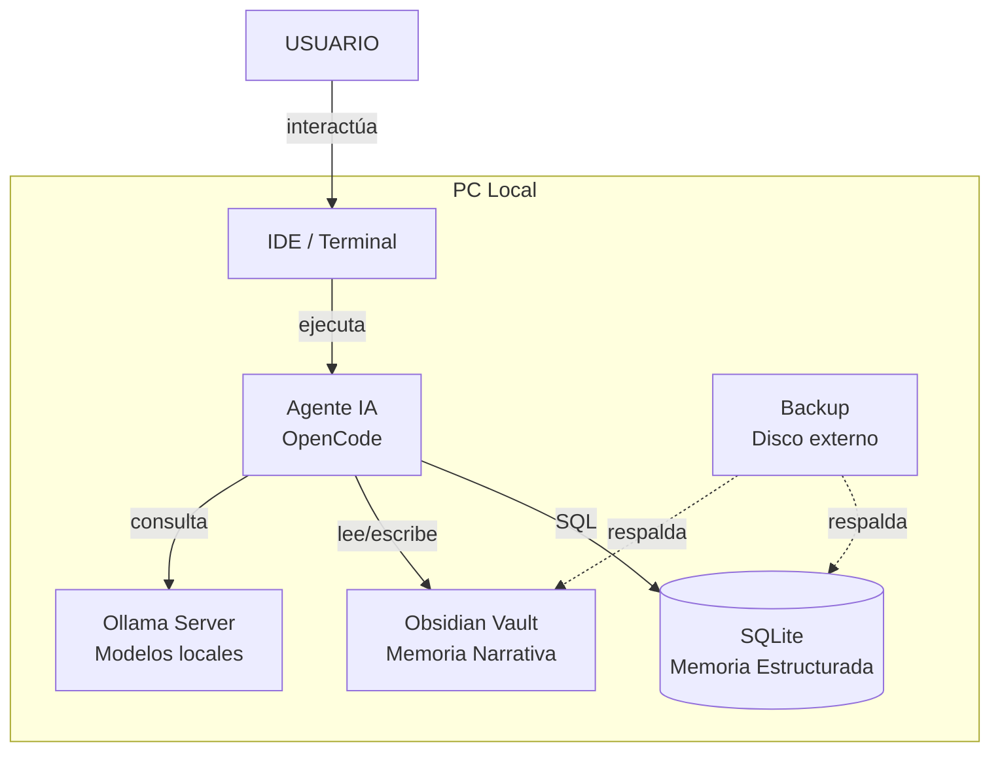

# Arquitectura SaDiT — Visión General

## Diagrama de Contexto

## Principios

1. **Local-first**: Todo corre en la PC, sin nube
2. **Dual-memory**: Dos sistemas de memoria complementarios
3. **Portable**: Configurable en cualquier PC via setup.ps1
4. **Recuperable**: Backup automático + plan de restauración
5. **Versionado**: Cambios trackeados con Git

## Archivos de Arquitectura

| Archivo | Contenido |
|---|---|
| `index.md` | Visión general |
| `01-memoria-dual.md` | Sistema de memoria dual |
| `02-flujo-sesion.md` | Ciclo de una sesión |
| `03-backup.md` | Estrategia de backup |
| `04-esquema-bd.md` | Modelo de base de datos |
